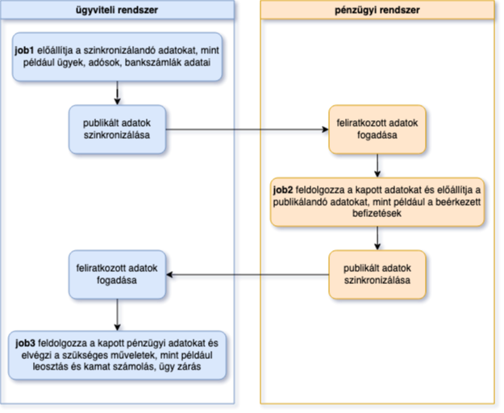

**Haladó adatbázis kezelő rendszerek**
Tóth István (J0P7MF)
2025.03.21

# Lakossági adósságkezelő rendszer egyszerűsített megvalósítása

## Feladat leírása
A beadandó feladatban egy valóságos adósságkezelő rendszer egyszerűsített változatát képeztem le. A mintául szolgáló rendszer több száz táblát, sok terrabájtnyi adatot, több tízezer sornyi tárolt eljárást tartalmaz és legalább 8 különböző alkalmazással van kapcsolata, az egyszerűsítés ezért elkerülhetetlen volt. Az eredeti rendszer tábláiból csak azokat valósítottam meg amelyeken keresztül egy egyszerűsített folyamat bemutatható és azokat is a szükséges minimális oszlop tartalommal. A cégtitkok megőrzése érdekében az eredeti rendszer tábla és oszlopnevei meg lettek változtatva, és más adatbázis kezelő rendszert használtam, hogy semmilyen átjárhatóság ne legyen a kettő rendszer között.
A megvalósított rendszerben az adósságkezelő cég fő ügyviteli folyamatát lehet végig követni, ami az adósságok partnerektől való megvásárlása a kamatok kiszámolása, a befizetések nyilvántartása (amely befizetéseket egy külön pénzügyi adatbázis szolgáltat), befizetések leosztása és az ügyek lezárása a tartozás megfizetése után.

## Alkalmazott technológiák
Az adatbázis kezelő rendszer a PostgreSQL(1), ezt egészíti ki a Pgpool(2) ami a load balancingot látja el, a replikáció felügyeletét a rempgr(3) valósítja meg, míg a jobok futtatását a pgAgent(4) látja el. A fejlesztés során a pgAdmin(5) környezetet alkalmaztam az adatbázis tervezéséhez és fejlesztéséhez, míg a felhasználói alkalmazást Visual Studio Code(6) segítségével fejlesztettem Python(7) nyelven NiceGUI(8) keretrendszerrel. Az egész rendszer Docker(9) környezetben fut, minden főbb komponens egy önálló konténerben fut.

## A rendszer magas szintű logikai felépítése

A rendszer legfontosabb komponensei a két egymással teljesen szinkronban lévő adatbázis, amelyeken az ügyviteli szoftver adatbázisa fut. A két szerver közül az elsődleges szerver írási és olvasási műveleteket is fogad, míg a másodlagos csak olvasási műveleteket tesz lehetővé. Ezek elé a szerverek elé van bekötve a load balancer, amely feladata jelen esetben az írási és olvasási műveletek tranzakció szintű szétválasztása. Ezekhez kapcsolódik egy újabb adatbázis, amely a pénzügyi rendszer adatbázisa. Ennek feladata az rendszerben szereplő adósok adatainak fogadása és a beérkező fizetések adatainak szolgáltatása az ügyviteli rendszer felé.
 
## Az ügyviteli rendszer szinkronizálása
Az ügyviteli rendszer két adatbázisának szinkronizálása szinkron módú streaming write-ahead log shippingel(10) valósul meg, amely a teljes adatbázis szinkronizálását teszi lehetővé. Ennek előnye, hogy a két adatbázis teljes szinkronban van, a primary szerver fogad csak írási tranzakciót és csak akkor igazolja vissza, ha a standby szerver visszajelzett a wal log fogadásáról és azt alkalmazta is. Ebből következik a hátránya is, hogy ez jelentős késleltetést, lassulást jelenthet a primary szerveren. A jelen környezetben az egy gépen futattott két Docker konténer között ez a késleltetés gyakorlatilag nem létezik, de valós környezetben erre figyelmet kell fordítani. A standby server hot standby(11) módban üzemel, amely megengedi olvasási kérések fogadását.

## Load balancing
A primary és a standby szerver között a Pgpool statement level load balancing(12) segítségével ossza szét a kéréseket. A jelen feladatban a terhelés természetesen nem akkora, hogy az írási és olvasási műveletek kiszolgálását szét kellene választani, de az eredeti rendszer modellezése céljából ezt hasonlóan valósítottam meg.

## High availability
A standby szerveren futó repmgrd(13) folyamatosan figyeli a kapcsolatot a primary szerverrel és amennyiben az nem elérhető, akkor a standby szervert promótálja primarynak, ami onnantól képes írási műveleteket is fogadni. Ez a megvalósított környezetben egy fél-egy perces kiesést jelent nagyjából, ez idő alatt a repmgrd észreveszi a failover(14) tényét, többször ellenőrzi a kapcsolatot hogy hosszabb távon is fennáll-e, majd promótálja a standby szervert. Eközben a Pgpool is érzékeli a primary kiesését és elindítja a failover(15) folyamatot, ami új primary keresését jelenti, amit a promótálás után meg is talál és innentől kezdve az írási műveleteket is ide továbbítja. A jelen feladatban a failover szimulálására az elkészített felhasználói felületen egy gomb segítségével le lehet állítani a primary szervert, aminek hatására a felület elveszíti a kapcsolatot, de nagyjából egy percen belül újra teljes funkcionalitással használható.
A primary szrver visszaállítása a jelen feladatban nem lett megvalósítva, mert ezt legtöbbször egyedi kézi beavatkozást és újraindításokat is igényel ha a szinkront és a high availabilityt is vissza akarjuk állítani. A wal fájlok fájl szintű archiválása egy archív mappába történik, amely ki van vezetve a konténerből, így a szükséges logok mindig rendelkezésre állnak a visszaállításhoz.

## A pénzügyi rendszer szinkronizálása
A pénzügyi rendszerbe csak a pénzügy számára szükséges adatok kerülnek szinkronizálásra ezért az logikai replikációval, publikáció és feliratkozás modellben(16) lett megvalósítva mindkét irányban. A pénzügy felé szinkronizálandó adatokat egy job állítja elő az ügyviteli rendszerben, ezek publikálva vannak és erre a pénzügyi rendszer a feliratkozó. A replikált adatokat a pénzügyi rendszerben ismét egy job dolgozza fel, amely az adatok alapján előállítja a visszaküldendő adatokat. Ezen adatok szintén publikálva vannak, erre az ügyviteli rendszer van feliratkozva. A visszaküldött adatok feldolgozása az ügyviteli rendszerben egy újabb job által történik.
 
Ideális esetben és valós körülmények között az áttöltések éjszaka történnek, a bemutató idejére azonban ezek a folyamatok fel lesznek gyorsítva, hogy szorosan egymást kövessék és látszódjon az eredményük.
Jelen feladatban a pénzügyi rendszer működésének megvalósítása nem volt cél, a küldött és fogadott adatok miatt van rá szükség, ezért annak nincs felülete és csak a fent leírt műveletekben vesz részt, ezért a munkatársak által végzett feladatok szimulálására az adatokat véletlenszerűen generálja.

 
## A rendszer egyes alacsonyabb szintű komponensei
 
## A használt adatbázis modell
 
 
## Hivatkozások
(1) PostgreSQL: https://www.postgresql.org/
(2) Pgpool: https://www.pgpool.net/mediawiki/index.php/Main_Page
(3) repmgr: https://www.repmgr.org/
(4) pgAgent: https://www.pgadmin.org/docs/pgadmin4/latest/pgagent.html
(5) pgAdmin: https://www.pgadmin.org/
(6) Visual Studio Code: https://code.visualstudio.com/
(7) Python: https://www.python.org/
(8) NiceGUI: https://nicegui.io/
(9) Docker: https://www.docker.com/
(10) streaming replication: https://www.postgresql.org/docs/current/warm-standby.html#STREAMING-REPLICATION
(11) hot standby: https://www.postgresql.org/docs/current/hot-standby.html
(12) statement level load balancing: https://www.pgpool.net/docs/45/en/html/runtime-config-load-balancing.html#GUC-STATEMENT-LEVEL-LOAD-BALANCE
(13) repmgrd: https://www.repmgr.org/docs/4.3/repmgrd-overview.html
(14) repmgrd failover: https://www.repmgr.org/docs/4.1/bdr-monitoring-failover.html
(15) Pgpool failover: https://www.pgpool.net/docs/latest/en/html/runtime-config-failover.html
(16) logical replication: https://www.postgresql.org/docs/current/logical-replication.html

